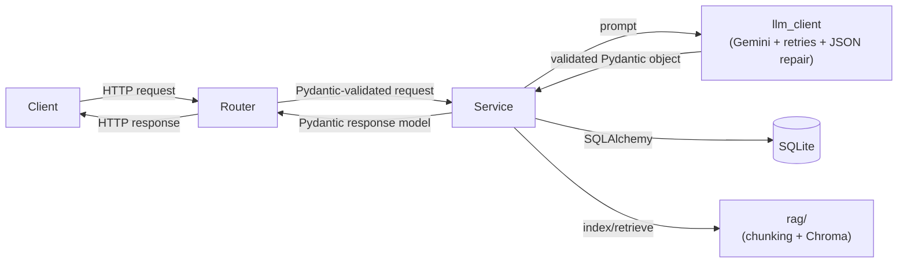
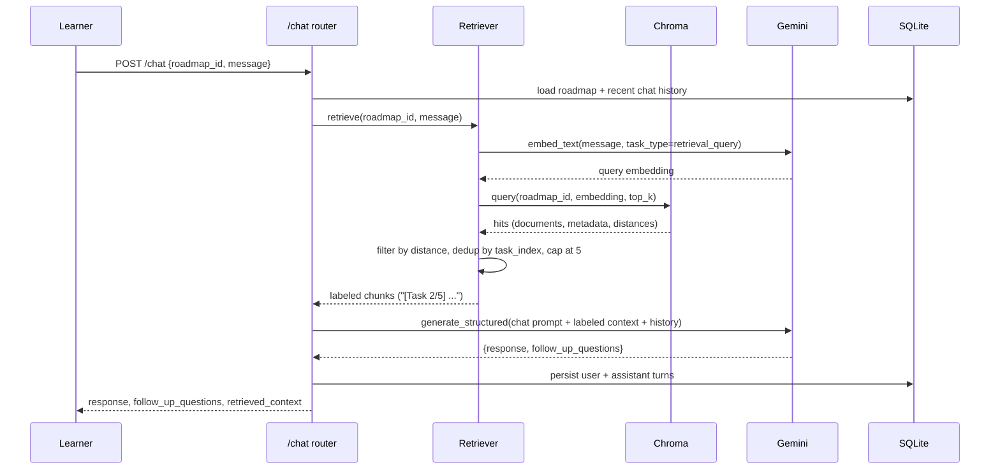

# AI Learning Assistant

A FastAPI backend that generates a personalized learning roadmap, recommends
a project, and answers follow-up questions about that roadmap through a
retrieval-augmented generation (RAG) chat endpoint — built with **FastAPI +
Pydantic + Google Gemini**.

## Table of contents

- [Architecture overview](#architecture-overview)
- [RAG flow](#rag-flow)
- [RAG design](#rag-design-chunking-embedding-retrieval)
- [Setup instructions](#setup-instructions)
- [Running tests](#running-tests)
- [API usage examples](#api-usage-examples)
- [Prompt design decisions](#prompt-design-decisions)
- [Error handling & robustness](#error-handling--robustness)
- [Logging](#logging)
- [Product-thinking feature: conversation history](#product-thinking-feature-conversation-history)
- [Resource recommendations](#resource-recommendations)
- [Roadmap markdown export](#roadmap-markdown-export)
- [Engineering decisions](#engineering-decisions)
- [Assumptions made](#assumptions-made)
- [Future improvements](#future-improvements)
- [Screenshots](#screenshots)
- [AI tools used](#ai-tools-used)
- [Time spent](#time-spent)

---

## Architecture overview

```
app/
├── main.py                # FastAPI app, lifespan startup, router registration, request-latency middleware
├── config.py               # pydantic-settings: all env vars, validated at boot
├── logging_config.py       # console + rotating file logging
├── exceptions.py           # AppError hierarchy + global exception handlers
├── prompts.py               # all prompt templates, kept out of the service layer
├── resources.py             # curated (non-LLM-generated) learning resource lookup
├── models/
│   ├── schemas.py           # Pydantic request/response + LLM-output schemas
│   └── db_models.py         # SQLAlchemy ORM models (Roadmap, ChatMessage)
├── db/
│   └── database.py          # SQLAlchemy engine/session, init_db()
├── rag/
│   ├── chunking.py          # roadmap -> semantic chunks (+ metadata for citations)
│   ├── vector_store.py      # Chroma persistent vector DB wrapper
│   └── retriever.py         # index_roadmap() / retrieve() (filtering, dedup, labeling)
├── services/
│   ├── llm_client.py        # Gemini wrapper: retries, JSON extraction, self-repair
│   ├── roadmap_service.py   # POST /roadmap logic + markdown export
│   ├── project_service.py   # POST /project business logic
│   └── chat_service.py      # POST /chat business logic (RAG orchestration)
└── routers/
    ├── roadmap.py            # POST /roadmap, GET /roadmap/{id}/markdown
    ├── project.py
    └── chat.py
tests/
├── conftest.py               # test-session env/storage isolation
└── test_api.py                # endpoint + JSON-parsing tests (pytest)
```

**Layered request flow** (e.g. `POST /roadmap`):



Each layer has one job: routers do HTTP/validation wiring, services hold
business logic and DB access, `llm_client` is the *only* file that talks to
the Gemini SDK (so swapping providers means touching one file), and `rag/`
is a self-contained retrieval subsystem.

**Persistence**: SQLite (via SQLAlchemy) stores roadmaps and chat history;
Chroma (embedded, persistent) stores roadmap chunk embeddings. Both persist
to `./data/` so restarting the server doesn't lose roadmaps or re-require
re-indexing.

## RAG flow

The `/chat` request path end-to-end:



## RAG design (chunking, embedding, retrieval)

The assignment explicitly requires "a full RAG system... rather than
in-memory context injection," so `/chat` is built as:

1. **Chunking** (`rag/chunking.py`): Instead of splitting the roadmap JSON by
   raw character/token count (which would slice a task's subtasks in half),
   chunks follow the roadmap's natural structure:
   - One **overview chunk** (goal, total hours, full skill list, task count) —
     so roadmap-level questions ("how long will this take overall?") retrieve
     something coherent.
   - One **chunk per top-level task**, each containing: the overall goal,
     its position in the sequence (`Task 2 of 5`), a back-reference to the
     *previous* task (so "what comes before Docker?" resolves from a single
     chunk), estimated hours, subtask titles, and curated resource labels.

   This is a deliberate departure from fixed-size chunking: the source
   document is short and highly structured, so chunking along its existing
   boundaries preserves more meaning per chunk than an arbitrary token
   window would. Each chunk also carries structured **metadata**
   (`roadmap_id`, `task_index`, `total_tasks`, `task_title`, `source_label`)
   so the retriever can filter, deduplicate, and cite a source without
   re-parsing the chunk text.

2. **Embedding**: Gemini's `text-embedding-004` model embeds each chunk at
   indexing time (`task_type="retrieval_document"`) and the user's message
   at query time (`task_type="retrieval_query"`) — Gemini's embedding API
   optimizes these differently, which measurably improves retrieval quality
   over using the same task type for both.

3. **Vector storage**: [Chroma](https://www.trychroma.com/), embedded and
   persisted to disk (`./data/chroma`). Chosen over a plain in-memory
   cosine-similarity loop because it (a) persists across restarts without
   re-embedding, (b) gives a real ANN index + metadata filtering for free,
   and (c) needs no separate server process — keeping setup to `pip install`.
   All chunks share one collection; retrieval is scoped per-roadmap via a
   `where={"roadmap_id": ...}` metadata filter, avoiding unbounded collection
   creation as more roadmaps are generated. Queries return `documents`,
   `metadatas`, and `distances` together (not just raw text), so relevance
   decisions happen in the retriever, not silently inside the store.

4. **Retrieval strategy** (`rag/retriever.py`), applied after the nearest-
   neighbor lookup:
   - **Similarity filtering** — hits with cosine distance above
     `MAX_DISTANCE` (0.8) are discarded rather than padding the prompt with
     weakly-related context just to fill `top_k` slots.
   - **Deduplication** — hits are deduped by `task_index`, guarding against
     the same task chunk being returned twice.
   - **Result cap** — hard-capped at `MAX_RESULTS` (5) regardless of how
     permissive the threshold is.
   - **Citation labeling** — each retained chunk is formatted as
     `[Task 2/5: Learn Docker] ...` before being injected into the prompt,
     so the model (and the `retrieved_context` field in the API response)
     can reference a specific task by name instead of speaking generically.

## Setup instructions

**Requirements**: Python 3.11+, a [Gemini API key](https://aistudio.google.com/apikey).

```bash
git clone <your-repo-url>
cd ai-learning-assistant

python3 -m venv venv
source venv/bin/activate          # Windows: venv\Scripts\activate

pip install -r requirements.txt

cp .env.example .env
# edit .env and set GOOGLE_API_KEY=<your key>

uvicorn app.main:app --reload
```

The API is now live at `http://localhost:8000`. Interactive docs (Swagger):
`http://localhost:8000/docs`.

No external database or vector-store server is required — SQLite and Chroma
both run embedded and write to `./data/`, which is created automatically on
first run.

### Running a quick smoke test

```bash
curl -X POST http://localhost:8000/roadmap \
  -H "Content-Type: application/json" \
  -d '{
    "goal_title": "Backend Developer",
    "experience": "Less than 1 year",
    "known_skills": ["Python", "SQL"],
    "learning_style": "Project Based",
    "weekly_hours": 15
  }'
```

Take the `roadmap_id` from the response and use it for `/project` and `/chat`.

## Running tests

```bash
pytest -v
```

`tests/conftest.py` points the DB and vector store at an isolated temp
directory and sets a dummy API key, and `tests/test_api.py` mocks the Gemini
calls (`generate_structured` / `embed_text`) so the suite runs offline and
deterministically. Coverage: roadmap/project/chat happy paths, validation
(422) and not-found (404)/missing-source (400) error paths, the markdown
export endpoint, and focused unit tests for the JSON-extraction robustness
(markdown fences, trailing commas, prose-wrapped JSON, braces inside string
values, and truncated JSON correctly raising instead of guessing).

## API usage examples

### `POST /roadmap`
Generates and persists a roadmap, and indexes it into the vector store for
later chat retrieval. See request/response shape in the assignment spec —
implemented exactly as specified.

### `POST /project`
Accepts **either** `{"roadmap_id": "..."}` **or**
`{"goal_title": "...", "skills": [...]}`. Returns 400 if neither is provided.

### `POST /chat`
Requires an existing `roadmap_id`. Returns a grounded `response` plus
anticipatory `follow_up_questions`, and (for transparency/debugging) the
`retrieved_context` chunks that were used to ground the answer.

## Prompt design decisions

- **System instruction vs. user prompt separation**: each endpoint has a
  fixed `*_SYSTEM_INSTRUCTION` (role framing, output-format rules) and a
  dynamically built user prompt (the actual request data). This keeps the
  "always JSON, no markdown fences" instruction stable and out of the way of
  the task-specific content.
- **Explicit schema restatement in every prompt**: Gemini's
  `response_mime_type="application/json"` guarantees syntactically valid
  JSON but *not* our specific field names/types, so every prompt explicitly
  restates the exact JSON shape expected. This measurably reduces schema-repair
  retries.
- **Grounding instruction for chat**: the chat system instruction tells the
  model to answer *primarily* from retrieved roadmap context but to fall
  back to general engineering knowledge (staying consistent with the
  roadmap's plan) if the context doesn't cover the question — a pure
  "context-only, refuse otherwise" instruction was tried first but produced
  unhelpfully evasive answers to reasonable questions slightly outside the
  roadmap's exact wording.
- **Follow-up questions as a first-class field**: rather than asking the
  model to "be helpful," `follow_up_questions` is a required structured
  field with explicit instructions to anticipate the learner's next
  question given the roadmap and conversation — making this behavior
  reliable and easy to render in a UI, rather than buried in free text.

## Error handling & robustness

- **Structured LLM output validation**: every LLM call goes through
  `generate_structured()`, which (1) strips markdown code fences, (2) parses
  JSON with a fallback brace-matching extractor for stray text, (3) validates
  against a strict Pydantic schema, and (4) on failure, sends the validation
  error back to the model and asks it to self-correct (bounded at 2 repair
  attempts) before raising a clean `502 LLMGenerationError`.
- **Transient network/API errors** (timeouts, 5xx, empty responses) are
  retried with exponential backoff via `tenacity` (up to 3 attempts),
  separate from the schema-repair loop above.
- **Domain errors** (`RoadmapNotFoundError`, `InvalidRequestError`) map to
  clean 404/400 JSON responses via a global exception handler; truly
  unexpected exceptions are caught, logged with full traceback, and returned
  as a generic 500 — the client never sees a raw stack trace.
- **Pydantic validation** on every request body (field types, length limits,
  numeric bounds, enum values) rejects malformed input before it reaches
  business logic, with FastAPI's standard 422 responses.
- **Logging**: structured console + rotating file logs (`logs/app.log`) at
  each layer (router entry, LLM retries/repairs, vector store operations,
  domain errors).

## Product-thinking feature: conversation history

`/chat` maintains real multi-turn memory: every user message and assistant
reply is persisted (`ChatMessage` table, keyed by `roadmap_id`), and the
most recent turns are pulled back in on each new message and included in the
prompt alongside the RAG-retrieved roadmap context. This means the assistant
correctly resolves references like "what about the second one?" or "how long
would that take total?" that depend on earlier turns — rather than treating
every message as a stateless, isolated question.

## Logging

Every request gets one summary log line from middleware
(`METHOD /path -> status (Nms)`), and each service layer logs its own
sub-timings and identifiers so a slow or failing request can be traced
without an external APM tool:

```
INFO  app.main            POST /roadmap -> 201 (612ms)
INFO  app.services.roadmap_service  Roadmap LLM call for goal='Backend Developer' completed in 540ms (6 tasks)
INFO  app.rag.retriever   Indexed roadmap_id=... into vector store (7 chunks, 210ms)
INFO  app.rag.retriever   Retrieval for roadmap_id=...: 3/5 hits kept after filtering (38ms)
INFO  app.services.chat_service     Chat LLM call for roadmap_id=... completed in 480ms (retrieved_chunks=3)
```

Logs go to both console and a rotating file (`logs/app.log`, 5MB × 3
backups); no external logging service is used, per the assignment's scope.

## Resource recommendations

Every roadmap task includes curated `resources` (label + URL). These are
**deliberately not LLM-generated** — asking a model for URLs is a well-known
hallucination trap (plausible-looking but dead or wrong links). Instead,
`app/resources.py` keeps a small hand-verified table of real documentation
URLs (official docs, MDN, freeCodeCamp, Microsoft Learn, etc.), and each
task title is matched against it deterministically via keyword substring
matching. An unmatched topic falls back to a roadmap.sh search link rather
than an invented URL. Extending coverage is just adding rows to the table —
no prompt changes needed.

## Roadmap markdown export

`GET /roadmap/{roadmap_id}/markdown` renders a previously generated roadmap
as a Markdown document (goal, skills, tasks with checkboxes, resource
links) — useful for saving into a notes app or committing alongside a repo.
Implemented as simple string templating in `roadmap_service.py`; no new
dependency was introduced for this.

## Engineering decisions

A few choices worth calling out explicitly, since they were deliberate
trade-offs rather than defaults:

- **Module-level singletons for the DB engine and Chroma client** (created
  once at import time in `db/database.py` and `rag/vector_store.py`) rather
  than per-request connections. This is the standard pattern for a
  single-process FastAPI service and avoids reconnect overhead on every
  request; the trade-off (harder to swap storage backends mid-process) is
  irrelevant at this scope and is exactly why the test suite isolates
  storage paths once per session (see `tests/conftest.py`) rather than
  per-test.
- **Granular exception types** (`EmbeddingError`, `VectorStoreError`,
  `DatabaseError`, `LLMTimeoutError`, in addition to the original
  `RoadmapNotFoundError` / `InvalidRequestError` / `LLMGenerationError`) map
  to distinct HTTP status codes (502/503/504) so a caller - or a person
  reading the logs - can immediately tell *which* dependency failed, without
  everything collapsing into a generic 500.
- **Resources are computed, not generated** (see above) — a deliberate
  accuracy-over-flexibility trade-off given the hallucination risk of
  LLM-produced URLs.
- **Chunk-level metadata over re-parsing chunk text**: `task_index`,
  `total_tasks`, and `source_label` are stored as Chroma metadata alongside
  each chunk specifically so retrieval-time filtering/dedup/citation don't
  need to regex the chunk's natural-language text.

## Assumptions made

- **Learning style / experience are free-ish text on the wire, constrained
  server-side**: `learning_style` is an enum (`Project Based`, `Theory Based`,
  `Video Based`, `Mixed`) matching the assignment's example; `experience` is
  kept as a short free-text string since the assignment didn't specify a
  fixed set of values.
- **`roadmap_id` is the natural key for `/chat`**: the roadmap must already
  exist (via `/roadmap`) before chatting about it; there's no endpoint to
  chat about an ad-hoc, non-persisted roadmap.
- **`/project`'s "OR" in the spec** is treated as "provide `roadmap_id`, or
  provide both `goal_title` and `skills`" — validated explicitly with a 400
  if neither combination is satisfied.
- **Authentication is out of scope** (per the assignment's notes marking it
  optional/bonus) — there is no user model or auth middleware; `roadmap_id`
  alone scopes access to a roadmap's data.
- **Single-process deployment**: SQLite + embedded Chroma are appropriate for
  this assignment's scope; a production deployment would swap
  `DATABASE_URL` to Postgres and (optionally) Chroma's client/server mode —
  no application code changes required for the former.

## Future improvements

Deliberately left out of scope for this assignment (see the "don't add"
list this polish pass was scoped against), but worth naming as deliberate
non-goals rather than oversights:

- **Auth** (JWT/OAuth) — noted as optional/bonus in the assignment; would
  scope roadmaps/chat history to a user instead of trusting `roadmap_id`
  alone.
- **Response caching** for identical `/roadmap` or `/project` requests -
  would cut latency and Gemini spend on repeated inputs; deferred since
  conversation history was chosen as the primary product-thinking feature.
- **Streaming responses** for `/chat` (Gemini supports streaming) - would
  improve perceived latency for longer answers; not needed at this scope
  where responses are short and structured.
- **Alembic migrations** instead of `create_all()` - only matters once the
  schema needs to evolve without dropping data, which is out of scope for a
  fresh assignment submission.
- **Broader resource coverage** - `app/resources.py`'s keyword table covers
  ~25 common topics; a production version might pull from a maintained
  external catalog instead of a static table.

## Screenshots

_Add screenshots or a GIF of `/docs` (Swagger UI) and a sample `/chat`
exchange here before submitting, per the assignment's demo requirement._

## AI tools used

Claude (Anthropic) was used as an AI coding assistant for two passes:
1. Initial scaffolding - project structure, FastAPI routers/services/RAG
   pipeline, and first README draft, based on the assignment's requirements.
2. A targeted polish/code-review pass - tightening prompts, enriching chunk
   metadata and retrieval filtering, hardening JSON parsing (trailing
   commas, prose-wrapped/truncated JSON), adding granular error types,
   request-latency logging, curated (non-hallucinated) resource links, the
   Markdown export endpoint, and a pytest suite - while deliberately
   preserving the existing architecture and avoiding scope creep (no auth,
   queues, or microservices were introduced).

All generated code was reviewed and verified: the full pytest suite (16
tests) runs green with mocked Gemini calls, the JSON-extraction edge cases
(trailing commas, prose-wrapped JSON, escaped braces inside string values,
truncated JSON correctly raising) were tested directly, and the FastAPI
`lifespan` startup hook was confirmed to fire correctly under `TestClient`.

## Time spent

Approximately 3–4 hours on the initial implementation, plus ~1.5 hours on
the subsequent polish/review pass.
